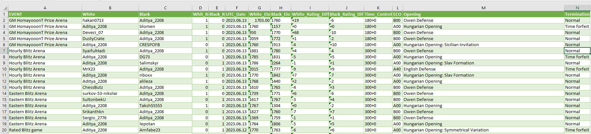
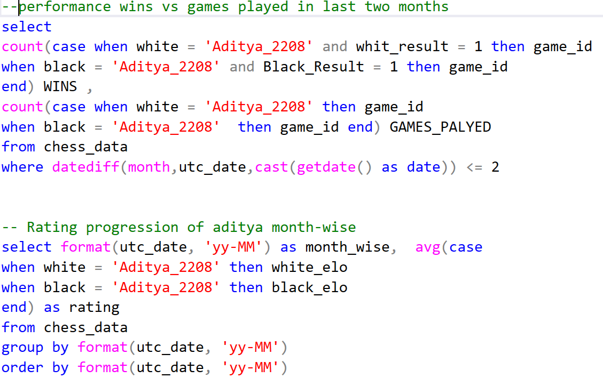
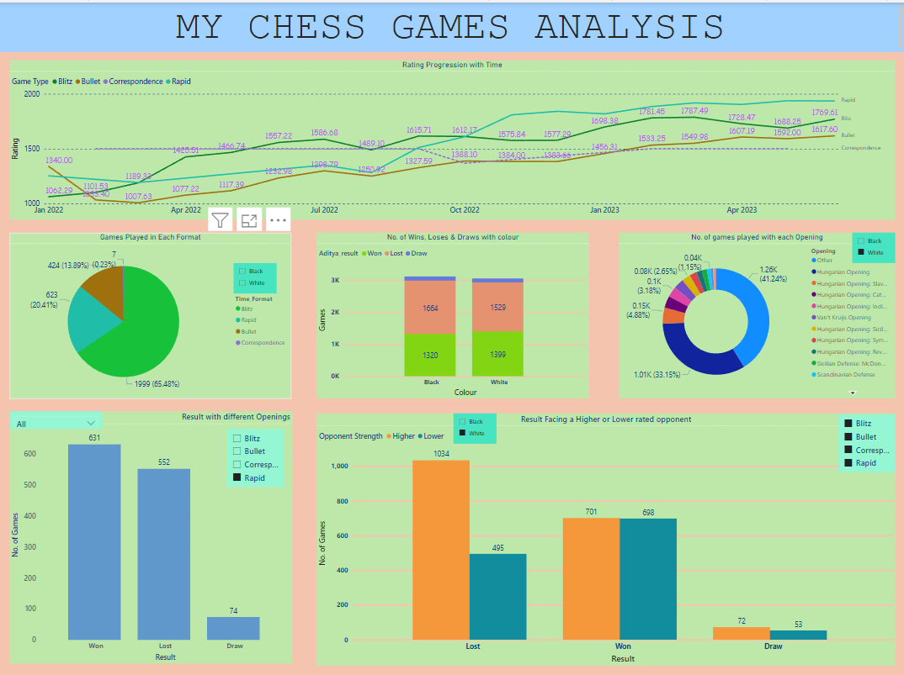

<h1 align="center">
MY CHESS GAMES ANALYSIS
</h1>

Hello everyone, so this the project in which I analyze my chess games extracted from [Lichess_Aditya.](https://lichess.org/@/Aditya_2208) I used extract feature availabel in lichess to extract your games.

The exctracted data looked like this:

   [Event "GM HomayooonT Prize Arena"]
[Site "https://lichess.org/Ef9FNGFu"]
[Date "2023.06.13"]
[White "Aditya_2208"]
[Black "blomen"]
[Result "1-0"]
[UTCDate "2023.06.13"]
[UTCTime "16:47:45"]
[WhiteElo "1760"]
[BlackElo "1157"]
[WhiteRatingDiff "+0"]
[BlackRatingDiff "+0"]
[Variant "Standard"]
[TimeControl "180+0"]
[ECO "A00"]
[Opening "Hungarian Opening"]
[Termination "Time forfeit"]

1. g3 { [%clk 0:01:30] } 1... d5 { [%clk 0:03:00] } 2. Bg2 { [%clk 0:01:30] } 2... Nf6 { [%clk 0:02:59] } 3. c3 { [%clk 0:01:29] } 3... Bf5 { [%clk 0:02:54] } 4. Qb3 { [%clk 0:01:28] } 4... Bxb1 { [%clk 0:02:52] } 5. Rxb1 { [%clk 0:01:23] } 5... b6 { [%clk 0:02:36] } 6. Nf3 { [%clk 0:01:20] } 6... e6 { [%clk 0:02:28] } 7. Nd4 { [%clk 0:01:19] } 7... Bc5 { [%clk 0:02:23] } 8. d3 { [%clk 0:01:18] } 8... Bxd4 { [%clk 0:02:22] } 9. cxd4 { [%clk 0:01:18] } 9... O-O { [%clk 0:02:19] } 10. e4 { [%clk 0:01:17] } 10... dxe4 { [%clk 0:02:18] } 11. dxe4 { [%clk 0:01:16] } 11... Qxd4 { [%clk 0:02:15] } 12. Be3 { [%clk 0:01:15] } 12... Qd6 { [%clk 0:02:01] } 13. e5 { [%clk 0:01:14] } 13... Qxe5 { [%clk 0:01:56] } 14. Bb7 { [%clk 0:01:12] } 14... Nbd7 { [%clk 0:01:35] } 15. Bxa8 { [%clk 0:01:10] } 15... Rxa8 { [%clk 0:01:35] } 16. O-O { [%clk 0:01:10] } 16... Ng4 { [%clk 0:01:32] } 17. Bf4 { [%clk 0:01:08] } 17... Qh5 { [%clk 0:01:17] } 18. h4 { [%clk 0:01:07] } 18... e5 { [%clk 0:01:11] } 19. Bd2 { [%clk 0:01:03] } 19... h6 { [%clk 0:01:07] } 20. Qf3 { [%clk 0:01:01] } 20... Qg6 { [%clk 0:01:02] } 21. Qxa8+ { [%clk 0:00:59] } 21... Kh7 { [%clk 0:00:57] } 22. Rbd1 { [%clk 0:00:58] } 22... Ndf6 { [%clk 0:00:39] } 23. Bc3 { [%clk 0:00:56] } 23... Ne4 { [%clk 0:00:23] } 24. Rd8 { [%clk 0:00:52] } 24... Qf6 { [%clk 0:00:08] } 25. Rh8+ { [%clk 0:00:50] } 25... Kg6 { [%clk 0:00:08] } 26. f3 { [%clk 0:00:49] } 26... Nxg3 { [%clk 0:00:01] } 27. Bxe5 { [%clk 0:00:44] } 27... Qxe5 { [%clk 0:00:00] } 28. fxg4 { [%clk 0:00:40] } 28... Qe4 { [%clk 0:00:00] } 29. Qxe4+ { [%clk 0:00:38] } 1-0 

## Steps for preprocessing of data and creating a good readable excel file  from it.

* This the data of single game, like this there were 6179 games. 

* I used a blank excel workbook and used "Get data from text". I transformed the data by using tab as a delimiter to form a table. 

* Then I used "extract text between" to get two columns one with headings and other with actual data.

* I got rid of irrelevant data like clock time and moves for this project.

* I loaded the data and inserted a table. Then filtered all the values and transposed them to form a sheet that looked like this:

---

## SQL QUERIES:
* After preprocessing I loaded the data in SQL Server and implemented some general queries to gather insights of the data.
* Tried different combinations to establish relation between multiple columns.
* Added some more columns to facilitate the data visualization.
* Here is the sample of my queries:

You can acess all the SQL Queries [here.](chess_data_sql_file.sql)

---

## Data Visualization:

* I used Power BI for the purpose of data visualization.
* My dashboard had six visuals they all represent different aspect of data.
* The first visual was "Rating progression with time", it shows how my rating increased or decreased over time in different game formats.
* Second visual indicates no. of games played in different formats we can also filter this with color("Black", "White").
* Third visual gives data of result for different colour and different format.
* Fourth visual represents opening choices made by me.
* Fifth visual represents how well I did in different opening choices I made". The results could be filtered on basis of format, colour and won or lost.
* Last visual gives info about how I perform when I face a better opponent and when I face a weaker opponent. 

* Here is a snapshot of my visualization:

---

<h2 align="center">
INSIGHTS GATHERED FROM THIS PROJECT
</h2>

* My rating is constantly getting better with time this means I am getting better with experience.
* I also tend to do much better in longer time format rather than shorter ones.
* Most of the games played were "Blitz" but not much improvement seen in Blitz rating, I need to play more attentively while playing blitz.

* I have win percent of 45.8% with White and 42.8 with black which is normal, so I don't have any issue with colour.

* Whenever I play openings that I have played most I tend to do better (Win rate is 46.8%) 
* But whenever I play openings belonging to "Others" category my win rate drops significantly. (Win rate is 
40.9%)
* Moreover their are certain opening in which I do a lot worse and should focus on knowing them these include:
1. Hugarian Opening Sicilian Invitation
2. Scandinavian defense Valencian variation

* Also I tend to play openings belonging to others category more when I am playing in shorter time format.
I should be more serious while playing them.

* When a higher rated opponent I do very well in some openings those are: 
1. Hungarian Opening Catalan Formation
2. English Opening

* I tend to draw my games more when I play a stronger oponent.
 
* In all departments my win rate gets 14.8% better when I am with White and time format is Rapid. And it gets 8.3% worse when I am playing Black in Blitz format.
---

## Further Analysis Improvement

I will be adding **date filter** to these data so I can see how my openings improved over the year. Because whenever you are  starting a new opening you tend to lose a lot then you improve so that could be an interesting parameter.

Also, Opponent strength can be further classified in Much Higher rated, Much Lower rated etc. Because when you play tournaments you are likely to face players of all rating.
Then those data could be treated as **outliers** and we can have more accurate analysis. 

More outliers could be removed if we consider number of moves played per game, because often you need to leave games in between because of multiple reasons. If moves played are less than certain number then we can remove those games.

